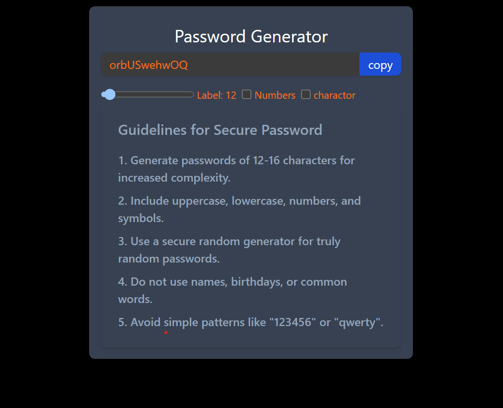

# Secure Password Generator



A secure password generator built using React, Tailwind CSS, and Node.js.

## Features

- Generate strong and secure passwords.
- Customize password length and character types.
- Avoid common patterns and easily guessable information.
- User-friendly interface with responsive design.

## Technologies Used

- **Frontend**: React, Tailwind CSS
- **Backend**: Node.js

## Installation and Setup

1. Clone this repository:

   ```bash
   git clone https://github.com/your-username/secure-password-generator.git

